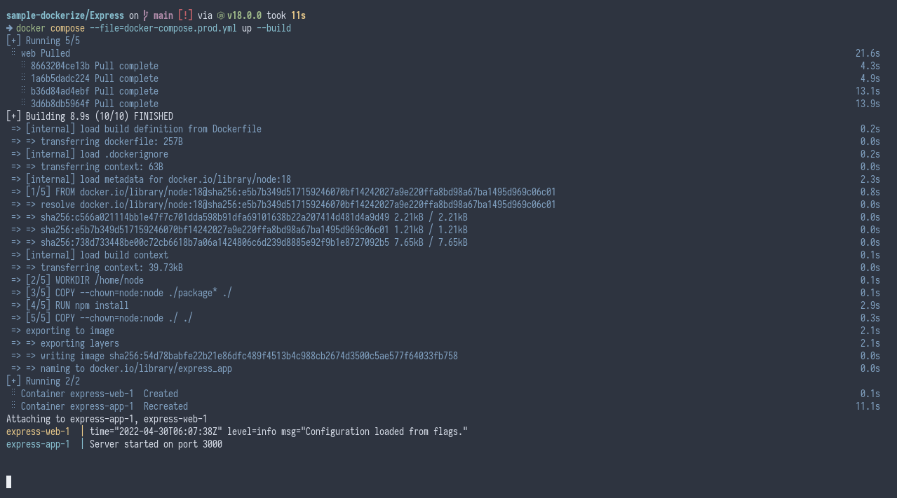

# Example Express Docker

This is a hello world app that is written in [Node.js](https://nodejs.org/) using [Express](https://expressjs.com/) framework, packaged using [Docker](https://www.docker.com/).

## Creating an Express App

### Installing Node.js

#### Installing Nvm

Refer to the [Nvm](https://github.com/nvm-sh/nvm#install--update-script) documentation for how to install Nvm.

#### Installing Node.js

It's a good practice to install the LTS version of Node.js.

```
nvm install --lts
```

### Installing Express

#### Create a directory for your app

```
mkdir express-app
```

#### Install Express

```
npm install express
```

Then you can import express from the `express` module.

```
const express = require('express');
```

## Code-base structure

```
project-name/           # The project's root directory
├───package-lock.json   # Dependency lock file
├───package.json        # Dependency file
└───server.js           # Main app
```

## Packaging

This is packaged by using the [Node.js container image](https://hub.docker.com/_/node) as a base, copying the source code and installs necessary dependencies of this app and adds a startup script in the end.

## Running

There are 2 modes for running this project, "development" and "production", It's up to the developers to define how their apps would behave under development environment and production environment. For example, development mode may use [SQLite](https://www.sqlite.org/) as a database whereas in production, the app will use [PostgreSQL](https://www.postgresql.org/).

Because this is just a hello world app, For the sake of simplicity, setting the build mode to "development" or "production" will not change the app behavior.

### Development

```
docker-compose up --build
```

### Production

```
docker-compose --file docker-compose.prod.yml up --build
```

## Customizing

Docker images can be customized using environment variables or customized during build time using build arguments.

### Environment Variables

No environment variables available.

### Build Arguments

| Key | Description |
| --- | --- |
| `NODE_VERSION` | The version of Node.js that will be used for building this image. |

## Screenshots


