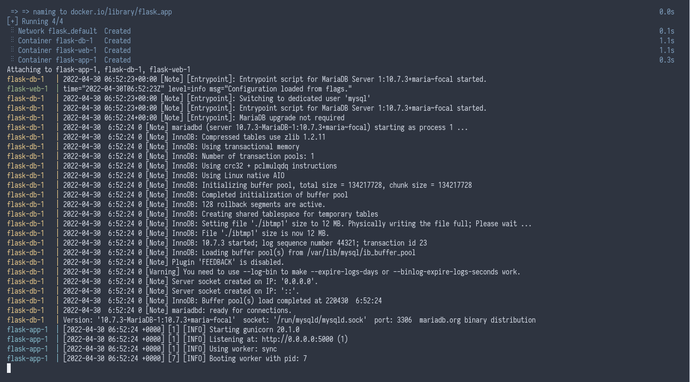

# Example Flask Docker

This is a view counter app that is written in [Python](https://www.python.org/) using [Flask](https://flask.palletsprojects.com/) framework, packaged using [Docker](https://www.docker.com/).

## Creating a Flask App

### Installing Python

Make sure to have Python installed and its package manager, `pip`.

```
python --version
pip --version
```

If the above command yields an error, install Python.

#### Debian-based distributions (Debian, Ubuntu, etc.)

```
sudo apt install python3 python3-pip
```

#### Red Hat-based distributions (CentOS, Fedora, etc.)

```
sudo yum install python3 python3-pip
```

#### Other Linux distributions

Refer to your Linux distribution's documentation for how to install Python.

### Installing Flask

#### Create a virtual environment

```
python3 -m venv venv
```

#### Activate the virtual environment

```
source venv/bin/activate 
```

#### Install Flask

```
pip install flask
```

Then you can import Flask in your code.

```
import flask
```

## Code-base structure

```
project-name/               # The project's root directory
└───src/                    # The project's app directory
    ├───init.sql            # Initial database
    ├───requirements.txt    # Requirements for the project
    └───main.py             # Main app
```

## Packaging

This is packaged by using the [Python container image](https://hub.docker.com/_/python) as a base, copying the source code and installs necessary dependencies of this app and adds a startup script.

## Running

There are 2 modes for running this project, "development" and "production", It's up to the developers to define how their apps would behave under development environment and production environment. For example, development mode may use SQLite as a database whereas in production, the app will use PostgreSQL.

In production, [Gunicorn](https://gunicorn.org/) is used as the server and bytecodes will be generated from the source code for faster startup whereas in development, a development server from Flask is used.

### Development

```
docker-compose up --build
```

### Production

```
docker-compose --file docker-compose.prod.yml up --build
```

## Customizing

Docker images can be customized using environment variables or customized during build time using build arguments.

### Environment Variables

| Key | Description |
| --- | --- |
| `MYSQL_HOST` | Hostname of the database server. |
| `MYSQL_USER` | Username that will be used to log in into the database server. |
| `MYSQL_PASSWORD` | Password that will be used to log in into the database server. |
| `MYSQL_DATABASE` | Database that will be used for storing data. |
| `BIND_ADDR` | IP Address to bind into. |

### Build Arguments

| Key | Description |
| --- | --- |
| `PYTHON_VERSION` | The version of Python that will be used for building this image, note that Python 2 is not supported. |

## Screenshots


