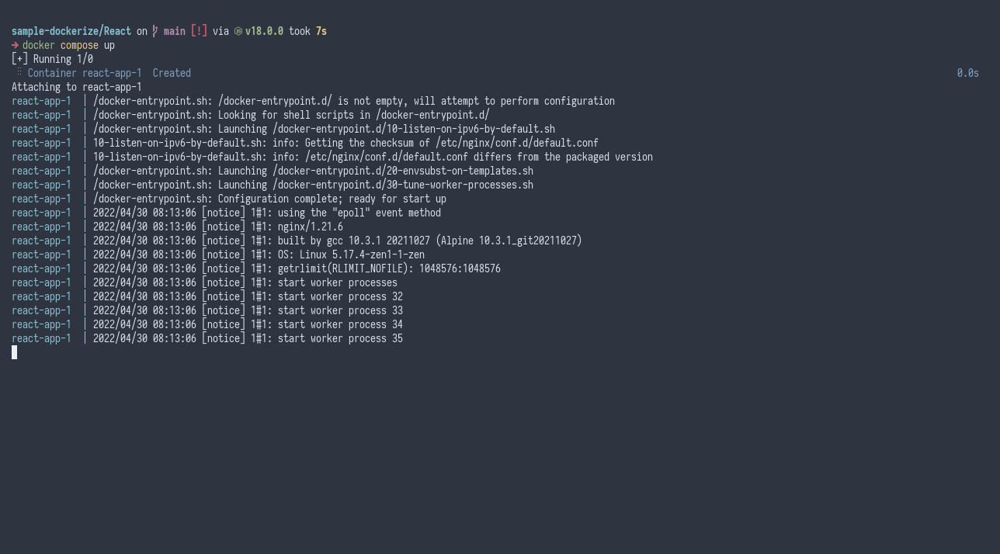

# Example React Docker

This is a hello world app that is written in Javascript using [React](https://reactjs.org/) framework, packaged using [Docker](https://www.docker.com/).

## Generating React Apps

React uses [Node.js](https://nodejs.org/) to transpile the source code into Javascript code that can run in client's web browser. Make sure to have Node.js installed and its package manager, `npm`.

### Installing Node.js

#### Installing Nvm

Refer to the [Nvm](https://github.com/nvm-sh/nvm#install--update-script) documentation for how to install Nvm.

#### Installing Node.js

It's a good practice to install the LTS version of Node.js.

```
nvm install --lts
```

#### Generating a React project

```
npx create-react-app project-name
```

## Code-base structure

```
project-name/           # The project's root directory
├───public/             # Static files directory
├───src/                # The project's source directory
│   ├───App.css         # The main application's CSS file
│   ├───App.js          # The main application
│   └───App.test.js     # The main application's test file
├───package-lock.json   # Dependency lock file
└───package.json        # Dependency file
```

## Packaging

This is packaged by using the [Node.js container image](https://hub.docker.com/_/node) as a base, copying the source code and installs necessary dependencies of this app, and transpile the source code into static files that can be deployed into any webservers. After that the build is transferred into an [Nginx container image](https://hub.docker.com/_/nginx).

## Running

This project doesn't have a specific modes to run.

```
docker-compose up --build
```

## Customizing

Docker images can be customized using environment variables or customized during build time using build arguments.

### Environment Variables

No environment variables available.

### Build Arguments

| Key | Description |
| --- | --- |
| `NODE_VERSION` | The version of Node.js that will be used for building this image. |

## Screenshots


