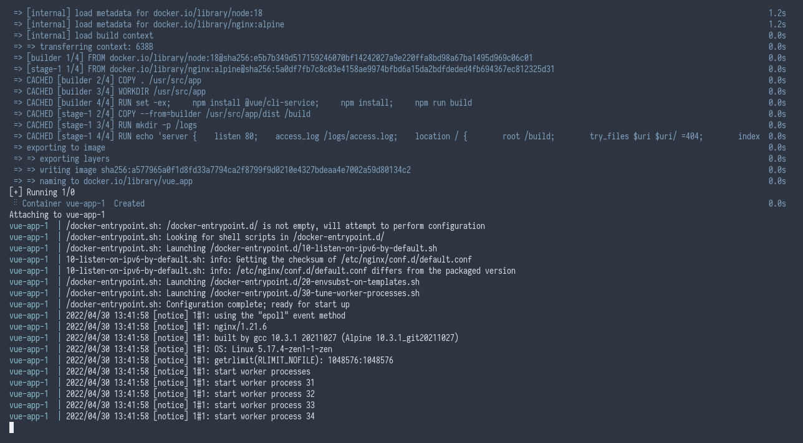

# Example React Docker

This is a hello world app that is written in Javascript using [Vue.js](https://vuejs.org/) framework, packaged using [Docker](https://www.docker.com/).

## Generating Vue.js Apps

Vue.js uses [Node.js](https://nodejs.org/) to transpile the source code into Javascript code that can run in client's web browser. Make sure to have Node.js installed and its package manager, `npm`.

Install `vue-cli` to easily bootstrap a Vue.js project.

```
npm install -g vue-cli
vue create project-name
```

## Packaging

This is packaged by using the [Node.js container image](https://hub.docker.com/_/node) as a base, copying the source code and installs necessary dependencies of this app, and transpile the source code into static files that can be deployed into any webservers. After that the build is transferred into an [Nginx container image](https://hub.docker.com/_/nginx).

## Running

This project doesn't have a specific modes to run.

```
docker compose up --build
```

## Customizing

Docker images can be customized using environment variables or customized during build time using build arguments.

### Environment Variables

No environment variables available.

### Build Arguments

| Key | Description |
| --- | --- |
| `NODE_VERSION` | The version of Node.js that will be used for building this image. |

## Screenshots


